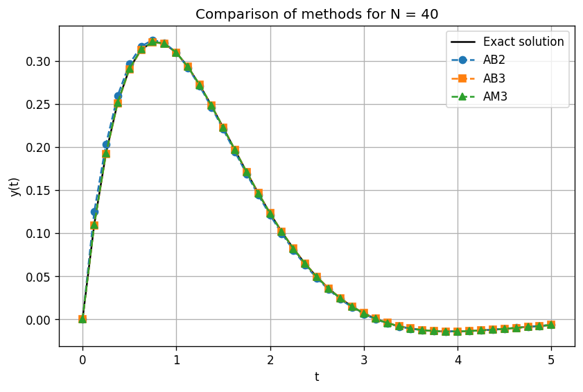
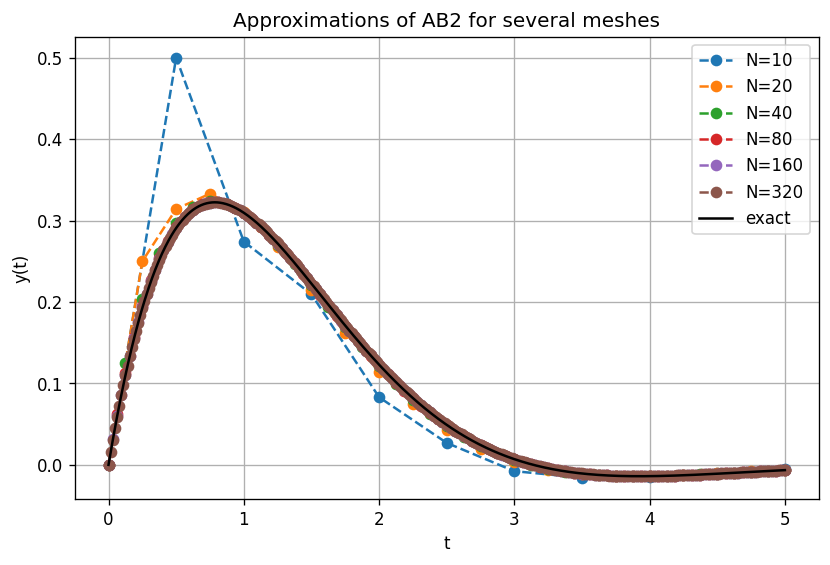
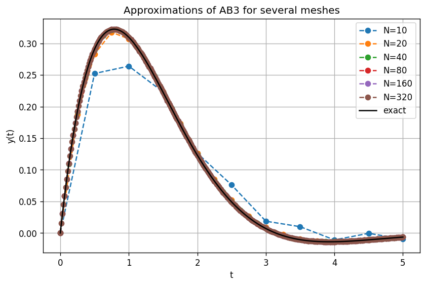
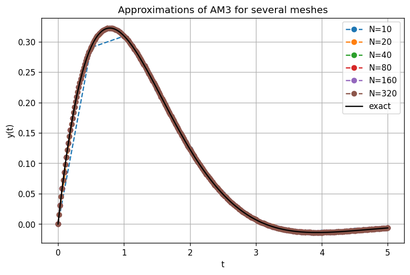

# Numerical Methods for ODEs

Implementation and comparison of several multistep numerical methods for approximating the solution of an ordinary differential equation (ODE), written in Python.

## Problem

The test problem is the initial value problem

$$y'(t) = -y(t) + e^{-t}\cos(t), \qquad y(0) = 0, \qquad t \in [0, 5]$$

whose exact solution is known:

$$y(t) = e^{-t}\sin(t)$$

Knowing the exact solution allows us to measure the error of each method precisely.

## Implemented methods

| Method | Function | Starting procedure |
|---|---|---|
| Adams–Bashforth, 2 steps (AB2) | `adams_bashforth2` | Euler's method |
| Adams–Bashforth, 3 steps (AB3) | `adams_bashforth3` | Midpoint method |
| Adams–Moulton, 3 steps (AM3), implicit | `adams_moulton3` | Runge–Kutta 4 (RK4) |

The implicit equation in AM3 is solved at each step with a fixed-point iteration (tolerance `1e-12`, maximum 200 iterations).

## Experiments

1. **Fixed mesh (N = 40):** prints the maximum error of each method and plots all approximations together with the exact solution.
2. **Several meshes (N = 10, 20, 40, 80, 160, 320):** for each method, prints the maximum error for every mesh and plots the approximations.
3. **Orders of convergence:** estimates the empirical order of each method as `log(e_{N/2} / e_N) / log(2)` when the mesh is refined.

## Repository structure

```
├── Numeric_methodes_for_ODEs.py   # Main script: methods and experiments
├── images/                        # Figures generated by the script (shown in Results)
├── requirements.txt               # Python dependencies
└── README.md
```

## Results

### Fixed mesh (N = 40)

| Method | Maximum error |
|---|---|
| AB2 | 1.50e-02 |
| AB3 | 1.14e-03 |
| AM3 | 4.04e-06 |



### Several meshes

| N | AB2 error | AB3 error | AM3 error |
|---|---|---|---|
| 10 | 2.09e-01 | 4.56e-02 | 7.53e-04 |
| 20 | 5.73e-02 | 7.88e-03 | 4.80e-05 |
| 40 | 1.50e-02 | 1.14e-03 | 4.04e-06 |
| 80 | 3.82e-03 | 1.53e-04 | 2.98e-07 |
| 160 | 9.66e-04 | 1.97e-05 | 2.02e-08 |
| 320 | 2.43e-04 | 2.50e-06 | 1.31e-09 |





### Empirical orders of convergence

| N | AB2 | AB3 | AM3 |
|---|---|---|---|
| 20 | 1.87 | 2.53 | 3.97 |
| 40 | 1.94 | 2.79 | 3.57 |
| 80 | 1.97 | 2.90 | 3.76 |
| 160 | 1.98 | 2.95 | 3.89 |
| 320 | 1.99 | 2.98 | 3.94 |

The empirical orders approach the theoretical ones: 2 for AB2, 3 for AB3 and 4 for AM3.

## Requirements

- Python 3
- NumPy
- Matplotlib

```bash
pip install -r requirements.txt
```

## Usage

```bash
python Numeric_methodes_for_ODEs.py
```

The script runs all three experiments, printing the results to the console and opening the corresponding figures. The figures shown in the Results section are stored in the `images/` folder.

## Author

Juan Antonio Gaspar Pascual
